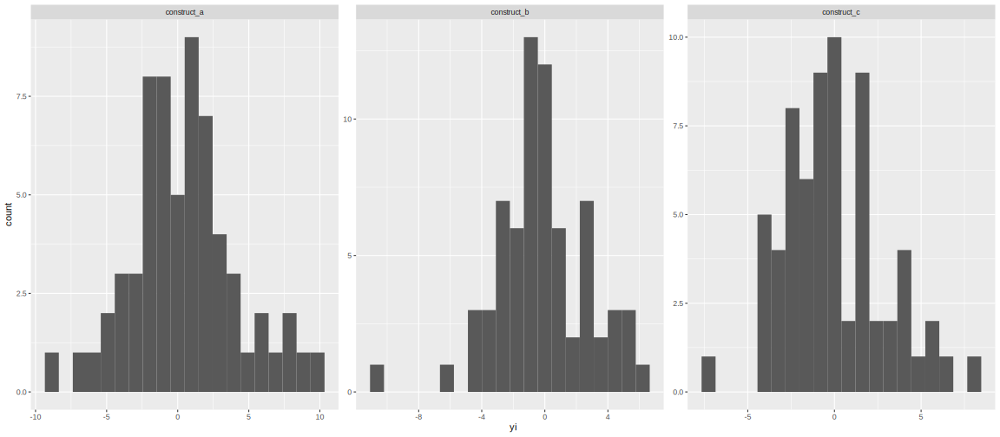
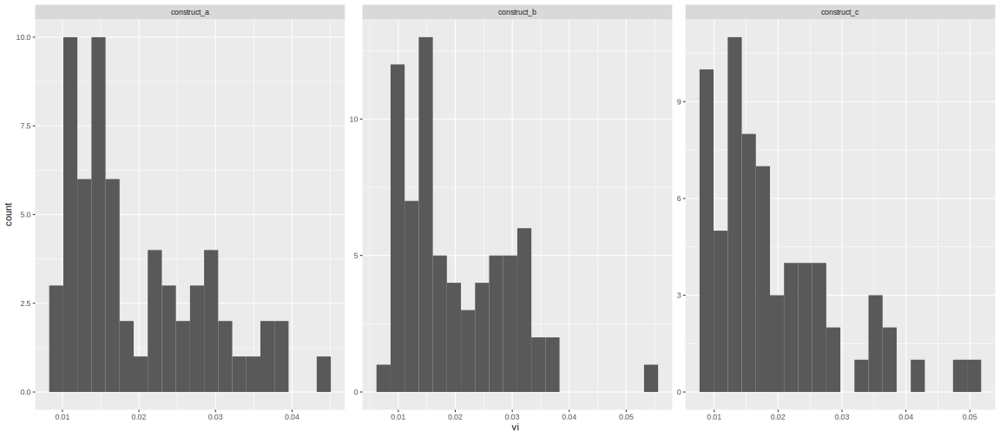
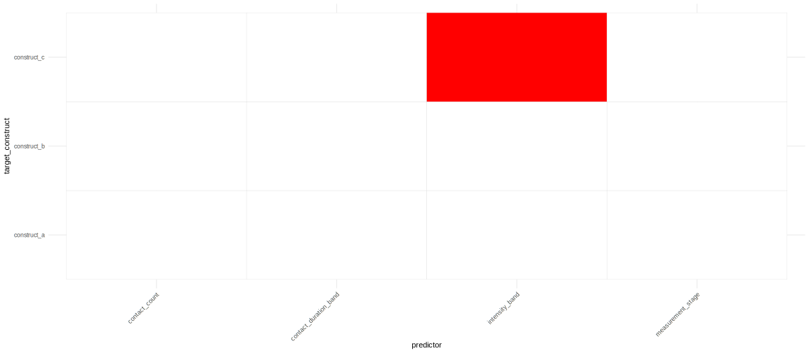
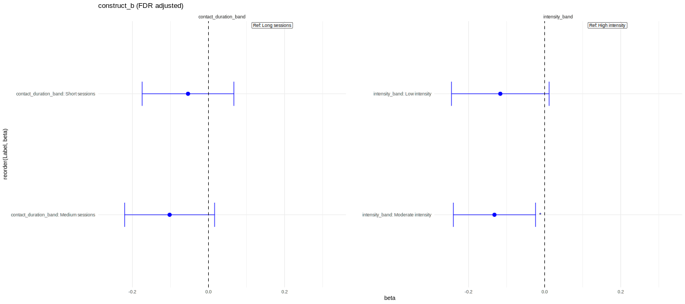

# meta-moderator-pipeline

## Intro and disclaimer

The idea is that this repository contains a generalized and self-contained version of a pipeline I developed while working on a systematic review in an academic clinical research setting. All datasets and results have been removed or replaced, and no proprietary or unpublished research data is included!

The core of the pipeline is implemented in```code/Analysis.R``` and example execution can be found inside of ```code/Runner.R```. Also contained inside ```code/Convenience.R``` are examples of how reusable configuration objects were structured for the various iterations of our analysis.

## Background

This project stems from the analysis for one of the projects my current group is working on where we are exploring the effects of a range of interventions on early behavioral outcomes.

We conducted a systematic review using standard screening tools (Covidence) to identify and extract data from a broad set of studies. These studies were then synthesized using established meta-analytic methods and software (Cochrane). The included studies varied in design, population characteristics, and intervention delivery, allowing us to examine patterns across diverse contexts. 

This inherent variability led us to design our meta-analysis under a random-effects model. The results indicated substantial heterogeneity, suggesting that effect sizes (Hedges’ g/SMD) varied meaningfully across studies.

To better understand this heterogeneity, we selected a set of moderators (predictors) relevant to study design and intervention characteristics. This motivated the development of a reusable pipeline for systematically evaluating moderator effects across multiple model specifications.

This repository contains a generalized version of that pipeline and is the result of that work. Feel free to adapt and use it as you please! It is intended both as a reusable tool for similar analyses and as a demonstration of my ongoing work in building reproducible, research-oriented data workflows in R. 

## Workflow
The pipeline is designed to take raw extracted study data and produce structured moderator analyses and visual outputs in a reproducible way. For exploration purposes a synthetic data generator is also included.

## 1. Data Preparation
- Categorical variables are recoded into standardized formats
- Relevant columns are cleaned and coerced to appropriate types

---

## 2. Effect Size Computation
- Standardized mean differences (SMD / Hedges’ g) and sampling variances are computed using `metafor::escalc()`
- Produces the core inputs (`yi`, `vi`) for meta-analysis

---

## 3. Exploratory Data Analysis 
- Histograms of effect sizes and variances are generated
- Helps identify skew, outliers, and distributional issues before modeling

  


---

## 4. Moderator Meta-Regression
- Univariate meta-regression models are fit across:
  - all predictors  
  - all target constructs (groupings)
- Implemented using `metafor::rma()` under a random-effects framework

---

## 5. Multiple Testing Correction
- P-values are adjusted within each group using methods such as:
  - FDR (Benjamini–Hochberg)  
  - Holm correction  

---

## 6. Results Aggregation and Labeling
- Model outputs are combined into structured result tables
- Categorical terms are mapped back to human-readable labels

---

## 7. Visualization
### Heatmaps highlight significant moderator effects across models  

  

### Forest-style plots display effect sizes and confidence intervals  



---

## 8. Output
- Clean datasets and model outputs are returned
- Plots and summaries can be saved for reporting and interpretation