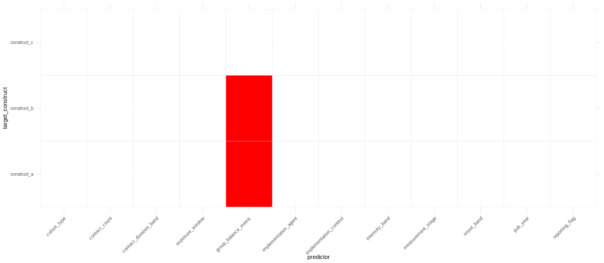

## Workflow
The pipeline is designed to take raw extracted study data and produce structured moderator analyses and visual outputs in a reproducible way. For exploration purposes a synthetic data generator is also included.

### 1. Data Preparation
- Categorical variables are recoded into standardized formats
- Relevant columns are cleaned and coerced to appropriate types

---

### 2. Effect Size Computation
- Standardized mean differences (SMD / Hedges’ g) and sampling variances are computed using `metafor::escalc()`
- Produces the core inputs (`yi`, `vi`) for meta-analysis

---

### 3. Exploratory Data Analysis 
- Histograms of effect sizes and variances are generated
- Helps identify skew, outliers, and distributional issues before modeling

  

---

### 4. Moderator Meta-Regression
- Univariate meta-regression models are fit across:
  - all predictors  
  - all target constructs (groupings)
- Implemented using `metafor::rma()` under a random-effects framework

---

### 5. Multiple Testing Correction
- P-values are adjusted within each group using methods such as:
  - FDR (Benjamini–Hochberg)  
  - Holm correction  

---

### 6. Results Aggregation and Labeling
- Model outputs are combined into structured result tables
- Categorical terms are mapped back to human-readable labels

---

### 7. Visualization
- Heatmaps highlight significant moderator effects across models  
- Forest-style plots display effect sizes and confidence intervals  

  
  

---

### 8. Output
- Clean datasets and model outputs are returned
- Plots and summaries can be saved for reporting and interpretation